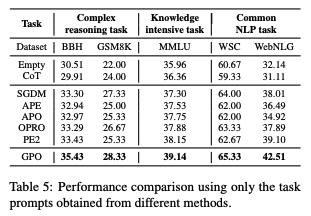

# Unleashing the Potential of Large Language Models as Prompt Optimizers: An Analogical Analysis with Gradient-based Model Optimizers

This repo provides the source code & data of our paper: Unleashing the Potential of Large Language Models as Prompt Optimizers: An Analogical Analysis with Gradient-based Model Optimizers.


## 😀 Overview

**Highlights**:

- 1️⃣ We are the first to conduct a systematic study for LLM-based prompt optimizers.
- 💡 By drawing inspiration from gradient-based model optimization techniques, we develop a capable **G**radient-inspired LLM based **P**rompt **O**ptimizer called **GPO**.
- 🔝 GPO brings an additional improvement of up to 56.8% on Big-Bench Hard and 55.3% on MMLU compared to baseline methods.

We propose a novel perspective to investigate the design of LLM-based prompt optimizers, by drawing an analogy with gradient-based model optimizers. By systematically analyzing a rich set of improvement strategies, we further develop a capable **G**radient-inspired LLM-based **P**rompt **O**ptimizer called **GPO**. At each step, it first retrieves relevant prompts from the optimization trajectory as the update direction. Then, it utilizes the generation-based refinement strategy to perform the update, while controlling the edit distance through a cosine-based decay strategy.

## 🚀 Quick Start

### Requirements

- python == 3.10.13
- vllm == 0.2.7
- transformers == 4.36.2
- sentence-transformers == 2.2.2
- openai == 0.28.0
- rouge == 1.0.1
- nltk == 3.8.1
- torch == 2.1.2

### Parameter Settings

#### Basic Configuration
- openai_api_key: The OpenAI API key. Required for accessing OpenAI's API services.
- gpus: Specifies the list of GPUs to be used. If multiple GPUs are provided, the model will utilize them.

#### Dataset and Task Configuration
- dataset: The dataset used for optimizing prompts (options: bbh, mmlu, gsm8k, webnlg, wsc).
- task_name: The tasks used for optimizing prompts. Use "all" to include all tasks.

#### Optimizer Configuration
- optimizer_llm_name: Name of the prompt optimizer LLM.
- optimizer_temperature: Temperature setting of the optimizer.

#### Prompt Optimization Configuration
- initial_instruction: Initial prompt for the optimization process.
- num_search_epochs: Number of epochs to optimize the prompt.
- opt_batch_size: Batch size for the optimization process.
- instruction_pos: Position of the prompt in the optimization process (options: before_Q, Q_begin, Q_end,A_begin).
- num_generated_instructions_in_each_step: Number of prompts generated in each optimization step.
- gradient_name: Name of gradient used in prompt optimization (options: -, feedback).
- momentum_para_name: Type of momentum used for optimization (options: -, para, feedback).
- momentum_selection_name: Method of the momentum selection used for optimization (options: -, recency, relavance, importance).
- momentum_selection_num: Number of momentum selections to use for optimization.
- momentum_update_name: Method of the momentum update used for optimization (options: -, k-list, real-time).
- learning_rate_name: Learning rate strategy used for optimization (options: w_lr, wo_lr).
- initial_step_size: Initial step size for optimization.
- decay_strategy: Type of decay strategy to apply (options: fixed, linear, cosine).
- use_warmup_strategy: Whether to use a warmup strategy for optimization.
- warmup_steps: Number of steps for the warmup process.
- final_step_size: Final step size after decay.
- util_gradient_name: Name of the utilized gradient for optimization (options: edit, generate, edit_without, generate_without).
- format_data_num: Number of format data of utilizing gradient to optimize the prompt.

#### Evaluation Configuration
- scorer_llm_name: Name of the task LLM.
- include_qa: Whether to include QA pairs in the prompt.
- only_evaluate: Whether the process should only evaluate without optimization.
- evaluate_generated_ins_on_few_shot: Whether to evaluate the generated prompts on a few-shot setting.
- few_shot_number: Number of demonstrations to include in the few-shot evaluation.

### Prompt Optimization
After completing the parameter settings above, you can conduct prompt optimization by executing the following script.
```bash
python src/optimization/main.py
```
In our experiments, we use GPO.sh as the script for our prompt optimization framework.
```bash
bash GPO.sh
```

## 🌟 Results
The prompts optimized by our LLM-based prompt optimizer GPO are in the **GPO_results.jsonl**

You can download the our immediate results from the [link](https://drive.google.com/file/d/1HX0e4Xyi_LPcMyjd6fq_x81pKhTp8vx0/view?usp=drive_link).



<<<<<<< HEAD
=======

## 📮 Contact
                      
If you have any questions for our paper or codes, please send an email to txy20010310@163.com.
>>>>>>> 388161b (first)
